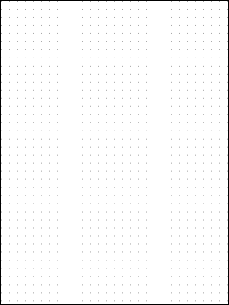
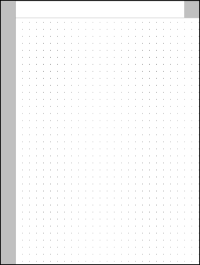
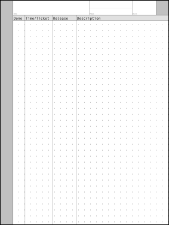

# Basic Templates

The `make-templates` script is a shell script which uses [ImageMagick](https://imagemagick.org/)'s `magick` command to create a few `.png` templates.

| Preview | Download
|:--------|:---------
| dots-only  | [rM12 Landscape](rm12/L-dots-only.png) [rM12 Portrait](rm12/P-dots-only.png)   [rMPP Landscape](rmpp/L-dots-only.png)  [rMPP Portrait](rmpp/P-dots-only.png)
| basic-page  | [rM12 Landscape LH](rm12/L-basic-page-lh.png)  [rM12 Landscape RH](rm12/L-basic-page-rh.png)  [rM12 Portrait LH](rm12/P-basic-page-lh.png)  [rM12 Portrait RH](rm12/P-basic-page-rh.png)   [rMPP Landscape LH](rmpp/L-basic-page-rh.png)  [rMPP Landscape RH](rmpp/L-basic-page-lh.png)  [rMPP Portrait LH](rmpp/P-basic-page-lh.png)  [rMPP Portrait RH](rmpp/P-basic-page-rh.png)
| daily-work  | [rM12 Landscape LH](rm12/L-daily-work-lh.png)  [rM12 Landscape RH](rm12/L-daily-work-rh.png)  [rM12 Portrait LH](rm12/P-daily-work-lh.png)  [rM12 Portrait RH](rm12/P-daily-work-rh.png)   [rMPP Landscape LH](rmpp/L-daily-work-lh.png)  [rMPP Landscape RH](rmpp/L-daily-work-rh.png)  [rMPP Portrait LH](rmpp/P-daily-work-lh.png)  [rMPP Portrait RH](rmpp/P-daily-work-rh.png)

## License

This script is too simple to *worry* about licensing, so...

To the extent possible under law, John Simpson has waived all copyright and related or neighboring rights to the scripts in this directory, and to the images they produce.

This work is published from the United States of America.

## Changelog

### 2024-10-20

Updated for the reMarkable Paper Pro tablet.

* Added option to specify how much space to leave between dots (default is 50). Renamed `dots-50` to `dots-only`, since the distance between the dots is now configurable.
* Added options to specify tablet type (default is rM1/rM2), orientation (default is portrait), and "handedness" (default is right-handed).
* Updated to calculate positions from the screen size, orientation, and "handedness".
* Updated `generate` script (which I use to generate the image files referenced in the `README.md` file) to generate all variants of each template.
* Updated this `README.md` file with links to all versions of the generated image files.

### 2023-09-09

Initial release
