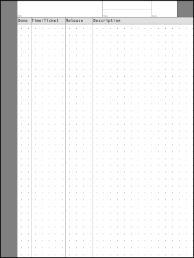

# Basic Templates

The `make-templates` script is a shell script which uses [ImageMagick](https://imagemagick.org/)'s `magick` command to create a few `.png` templates.

* [`dots-50.png`](dots-50.png)

    

* [`basic-page.png`](basic-page.png)

    

* [`daily-work.png`](daily-work.png)

    

## License

This script is too simple to *worry* about licensing, so...

To the extent possible under law, John Simpson has waived all copyright and related or neighboring rights to this script or the images it produces.

This work is published from the United States of America.
