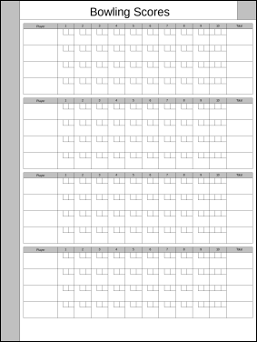
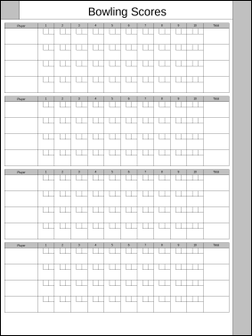

# Bowling

The `rm2-template-bowling` script uses the [Perl-GD module](https://github.com/lstein/Perl-GD) (which uses the [GD library](https://libgd.github.io/)) to create a form for keeping score in bowling games.

| Right Handed | Left Handed |
|:------------:|:-----------:|
| [`Bowling-rh.png`](Bowling-rh.png)<br/> | [`Bowling-lh.png`](Bowling-lh.png)<br/>

The template files in the repo have 4 player rows in each group. If you need more or less player rows, you can use the `-p` option. For example, if you normally play in a group of five people, you could run the script as `rm2-template-bowling -p 5 -o Bowling-5.png` to generate a template with five player rows in each group.

I made this script after reading [this comment on Reddit](https://www.reddit.com/r/RemarkableTablet/comments/15l3a9p/) and thinking to myself, "you know, it wouldn't be *that* hard to make a template for bowling scores, and maybe somebody out there could use one" ... two hours later, here it is.

And for the record, I haven't bowled in over twenty years. This was just a fun little programming project for me, and if at least one person out there ends up using these templates, I consider it my good deed for the day.

## Using the script

If you run the script with the `-h` option, it will show you a list of the options it supports.

```
$ ./rm2-template-bowling -h
./rm2-template-bowling [options]

Create a reMarkable 2 template for a simple monthly calendar.

-l or -r    Left- or Right-handed. Default is Right-handed.

-o ___      Specify the name of the file to write. Default is 'Bowling.png'.

-p ___      Players per game. Default is 4.

-h          Show this help message.
```

For example, if your tablet is "right handed" and you bowl in a group of three people, you might run this:

```
$ ./rm2-template-bowling -r -p 3 -o Bowling-3.png
```

## License

This script is licensed under the MIT License.

**The MIT License (MIT)**

Copyright &copy; 2023 John Simpson

Permission is hereby granted, free of charge, to any person obtaining a copy of this software and associated documentation files (the “Software”), to deal in the Software without restriction, including without limitation the rights to use, copy, modify, merge, publish, distribute, sublicense, and/or sell copies of the Software, and to permit persons to whom the Software is furnished to do so, subject to the following conditions:

The above copyright notice and this permission notice shall be included in all copies or substantial portions of the Software.

THE SOFTWARE IS PROVIDED “AS IS”, WITHOUT WARRANTY OF ANY KIND, EXPRESS OR IMPLIED, INCLUDING BUT NOT LIMITED TO THE WARRANTIES OF MERCHANTABILITY, FITNESS FOR A PARTICULAR PURPOSE AND NONINFRINGEMENT. IN NO EVENT SHALL THE AUTHORS OR COPYRIGHT HOLDERS BE LIABLE FOR ANY CLAIM, DAMAGES OR OTHER LIABILITY, WHETHER IN AN ACTION OF CONTRACT, TORT OR OTHERWISE, ARISING FROM, OUT OF OR IN CONNECTION WITH THE SOFTWARE OR THE USE OR OTHER DEALINGS IN THE SOFTWARE.
