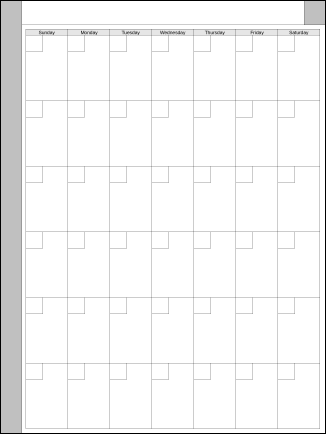
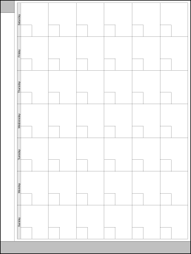
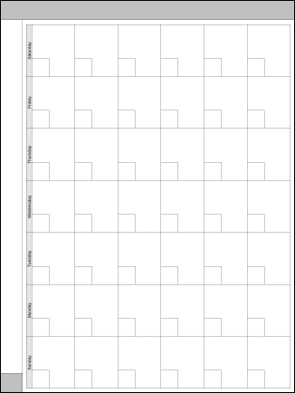

# Calendars - Month

This is just a simple monthly calendar. If you're willing to write in your own title (i.e. "July 2023") and numbers in each date's block, it can be used for *any* month you like. It can also be used for a time period of up to six weeks which *isn't* a month.

| Orientation | Right Handed | Left Handed |
|------------:|:------------:|:-----------:|
| Portrait    | <br/>[(rM1/rM2)](rm12/P-CalendarMo-rh.png) - [(rMPP)](rmpp/P-CalendarMo-rh-png) | <br/>[(rM1/rM2)](rm12/P-CalendarMo-lh.png) - [(rMPP)](rmpp/P-CalendarMo-lh-png) |
| Landscape   | <br/>[(rM1/rM2)](rm12/L-CalendarMo-rh.png) - [(rMPP)](rmpp/L-CalendarMo-rh.png) | <br/>[(rM1/rM2)](rm12/L-CalendarMo-lh.png) - [(rMPP)](rmpp/L-CalendarMo-lh.png) |

This was the first template script where I made both right- and left-handed versions, then a few days later, added Landscape versions. It was also the first template I made using Perl, with the GD graphics library. Now that I've done this one, I suspect that if I make any more templates, I'll be using Perl and GD for those as well.

The script also has an option where, if you give it a year and month, it will fill in a title and the day numbers. I'm not sure how useful the resulting image is *as a template*, since it could only be used for that one month, but if that's something you would find useful, you can add "`-m 2023-07`" to the command line.

## Using the script

If you run the script with the `-h` option, it will show you a list of the options it supports.

```
$ ./rm2-template-calendar -h
./rm2-template-calendar [options]

Create a reMarkable 2 template for a simple monthly calendar.

-p          Generate template with page size to match rMPP (1620x2160).
            Default is to match rM1/rM2 (1404x1872).

-l or -r    Left- or Right-handed. Default is Right-handed.

-L or -P    Landscape or Portrait. Default is Portrait.

-m ___      Month to pre-number. Must be "YYYY-MM" format (i.e. "2023-07")
            Default is no month, i.e. no pre-filled dates.

-M ___      Specify the width of the menu bar on the side. Default is 104
            to match current versions, however if you'll be using the template
            with an older software version you may need 120.

-o ___      Specify the name of the file to write. Default is 'CalendarMo.png'.

-h          Show this help message.
```

For example, to generate the template I actually use on my tablets (portrait, right-handed), I ran the following:

```
$ ./rm2-template-calendar -Pr -o P-CalendarMo-rh.png
```

## License

This script is licensed under the MIT License.

**The MIT License (MIT)**

Copyright &copy; 2023-2024 John Simpson

Permission is hereby granted, free of charge, to any person obtaining a copy of this software and associated documentation files (the “Software”), to deal in the Software without restriction, including without limitation the rights to use, copy, modify, merge, publish, distribute, sublicense, and/or sell copies of the Software, and to permit persons to whom the Software is furnished to do so, subject to the following conditions:

The above copyright notice and this permission notice shall be included in all copies or substantial portions of the Software.

THE SOFTWARE IS PROVIDED “AS IS”, WITHOUT WARRANTY OF ANY KIND, EXPRESS OR IMPLIED, INCLUDING BUT NOT LIMITED TO THE WARRANTIES OF MERCHANTABILITY, FITNESS FOR A PARTICULAR PURPOSE AND NONINFRINGEMENT. IN NO EVENT SHALL THE AUTHORS OR COPYRIGHT HOLDERS BE LIABLE FOR ANY CLAIM, DAMAGES OR OTHER LIABILITY, WHETHER IN AN ACTION OF CONTRACT, TORT OR OTHERWISE, ARISING FROM, OUT OF OR IN CONNECTION WITH THE SOFTWARE OR THE USE OR OTHER DEALINGS IN THE SOFTWARE.
