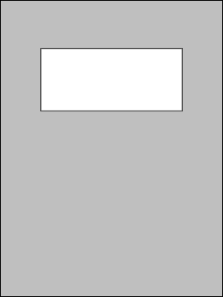
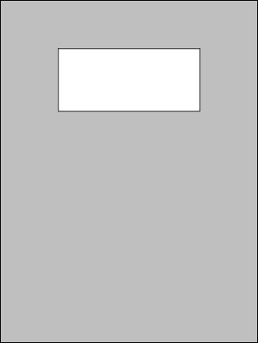

# Simple Cover Page

The `rm2-template-cover` shell script uses [ImageMagick](https://imagemagick.org/)'s `magick` command to create a simple `.png` template which can be used as a "cover page" for notebooks in a reMarkable tablet. It looks like this ...

* [`cover-simple-rm2.png`](cover-simple-rm2.png)

    

* [`cover-simple-rmpp.png`](cover-simple-rmpp.png)

    

*Hey, I said it was simple ...* &#x1F601;

## Options

Run the script with `-p` to generate a template matching the screen size and colour depth of the rMPP. Without this, the template will match the screen size and colour depth of the rM1/rM2.

Use other options to set the size and position of the box, as well as the background colour.

* `-B ___` specifies the background colour. You can use any colour that ImageMagick recognizes, run `magick -list color` for a list.

* `-W ___` sets the width of the box, in pixels. Default is 900.

* `-H ___` sets the height of the box, in pixels. Default is 400.

* `-Y ___` sets the vertical position of the top of the box, in pixels. Default is 300.

## License

The MIT License (MIT)

Copyright &copy; 2023-2025 John Simpson

Permission is hereby granted, free of charge, to any person obtaining a copy of this software and associated documentation files (the “Software”), to deal in the Software without restriction, including without limitation the rights to use, copy, modify, merge, publish, distribute, sublicense, and/or sell copies of the Software, and to permit persons to whom the Software is furnished to do so, subject to the following conditions:

The above copyright notice and this permission notice shall be included in all copies or substantial portions of the Software.

THE SOFTWARE IS PROVIDED “AS IS”, WITHOUT WARRANTY OF ANY KIND, EXPRESS OR IMPLIED, INCLUDING BUT NOT LIMITED TO THE WARRANTIES OF MERCHANTABILITY, FITNESS FOR A PARTICULAR PURPOSE AND NONINFRINGEMENT. IN NO EVENT SHALL THE AUTHORS OR COPYRIGHT HOLDERS BE LIABLE FOR ANY CLAIM, DAMAGES OR OTHER LIABILITY, WHETHER IN AN ACTION OF CONTRACT, TORT OR OTHERWISE, ARISING FROM, OUT OF OR IN CONNECTION WITH THE SOFTWARE OR THE USE OR OTHER DEALINGS IN THE SOFTWARE.
