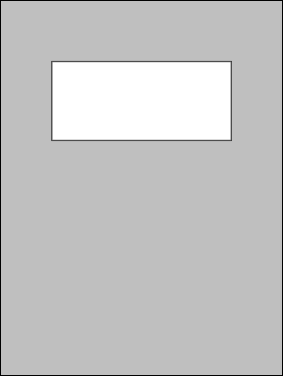

# Simple Cover Page

The `rm2-template-cover` shell script uses [ImageMagick](https://imagemagick.org/)'s `magick` command to create a simple `.png` template which can be used as a "cover page" for notebooks in a reMarkable tablet. It looks like this ...

* [`cover-simple.png`](cover-simple.png)

    

*Hey, I said it was simple ...* &#x1F601;

## Customizing the script

You can modify the size and position of the box on the page by editing the script and changing the values of the following variables:

* `BOX_W` is the width of the box.
* `BOX_H` is the height of the box.
* `BOX_Y` is the vertical position of the top of the box. 0 is the top of the image.

There is no `BOX_X`, the script will automatically center the box horizontally on the page.

## License

This script, and the `.png` files it creates, are too simple to *worry* about licensing, so...

To the extent possible under law, John Simpson has waived all copyright and related or neighboring rights to this script and/or the image files it produces.

These works are published from the United States of America.
