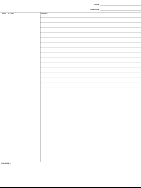

# Focus Notes

The `rm2-template-focus-notes` shell script uses [ImageMagick](https://imagemagick.org/)'s `magick` command to create a simple `.png` template which looks like the "Focus Notes" layout, illustrated in the attachment to [this Reddit post](https://www.reddit.com/r/RemarkableTablet/comments/16iyq60/focus_notes_template/).

* [`focusnotes.png`](focusnotes.png)

    

I wrote this after seeing [this question](https://www.reddit.com/r/RemarkableTablet/comments/16iyq60/focus_notes_template/) on Reddit. I thought it sounded like something really simple, and ... turns out I was right.

## License

This script, and the `.png` files it creates, are too simple to *worry* about licensing, so...

To the extent possible under law, John Simpson has waived all copyright and related or neighboring rights to this script and/or the image files it produces.

These works are published from the United States of America.
